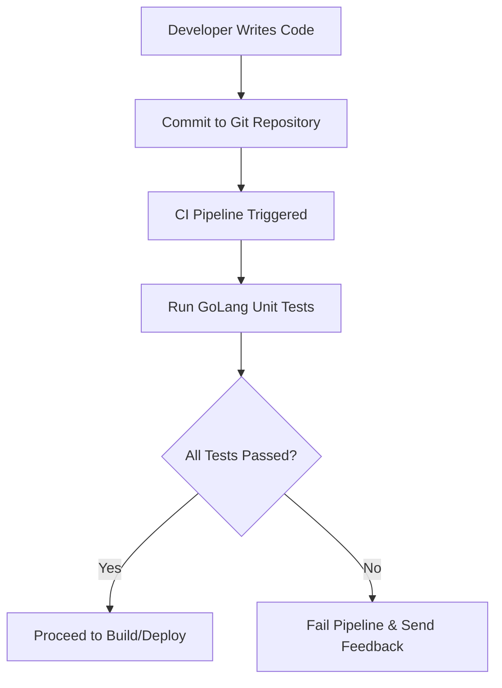

# GoLang CI Checks - Unit Testing Documentation

---

##   Author Information

| **Author**   | **Created on** | **Version** | **Last updated by** | **Last edited on** | **Level** | **Reviewer**  |
|--------------|----------------|-------------|---------------------|--------------------|-----------|---------------|
| Tina Bhatnagar  | 17-08-25    | v1.0  |  Tina Bhatnagar |17-08-25     | Internal    | Rohit Chopra    |

---

## Table of Contents

1. [Introduction](#1-introduction)  
2. [What is Unit Testing?](#2-what-is-unit-testing?)  
3. [Why Unit Testing in GoLang CI?](#3-why-unit-testing-in-goLang-ci?)  
4. [Workflow](#4-workflow)   
5. [Different Tools](#5-different-tools)  
6. [Comparison Table](#6-comparison-table)  
7. [Advantages](#7-advantages)  
8. [Disadvantages](#8-disadvantages)  
9. [POC](#9-poc)  
10. [Best Practices](#10-best-practices)  
11. [Conclusion](#11-conclusion)  
12. [FAQs](#12-faqs)  
13. [Contact Information](#13-contact-information)  
14. [References](#14-references)  

---

## 1. Introduction

This document provides a comprehensive overview of Unit Testing in GoLang CI (Continuous Integration) pipelines. It covers the fundamentals of unit testing, its importance in CI/CD workflows, the typical workflow followed in GoLang projects, different types of testing approaches, along with their advantages and best practices.

---

## 2. What is Unit Testing?

Unit testing is a fundamental practice in software development where individual components (functions, methods, or packages) are tested in isolation.
In GoLang Continuous Integration (CI) pipelines, unit tests play a critical role in ensuring that code is reliable, maintainable, and bug-free before moving to higher environments.

---

## 3. Why Unit Testing in GoLang CI?

| Benefit / Purpose                                 | Description                                                      |
|--------------------------------------------------|------------------------------------------------------------------|
| Code Correctness                                  | Ensures code correctness during every commit or merge           |
| Early Bug Detection                               | Detects bugs early in the development lifecycle                 |
| Developer Confidence                              | Improves developer confidence when refactoring                  |
| CI Automation                                     | Automates verification in CI pipelines                           |
| Code Quality Maintenance                          | Helps maintain code quality across teams                        |

---

## **Workflow Diagram**

---

## **Different Types of Unit Testing**

* **Positive Testing** → Verifies expected input produces correct output.
* **Negative Testing** → Ensures invalid inputs are handled properly.
* **Boundary Testing** → Tests edge cases (e.g., min/max values).
* **Mock Testing** → Uses mock objects to simulate dependencies.

---

## **Advantages of Unit Testing**

| Advantage                       | Description                                                     |
| ------------------------------- | --------------------------------------------------------------- |
| **Early Bug Detection**         | Identifies issues before they propagate to higher environments. |
| **Continuous Delivery Support** | Provides confidence for frequent releases and deployments.      |
| **Reduced Debugging Time**      | Faster root cause analysis and quicker fixes.                   |
| **Improved Code Design**        | Encourages modular, maintainable, and testable code.            |
| **Reusability**                 | Ensures tested components can be reused safely across projects. |

---

## **Best Practices**

| Best Practice                      | Description                                                   |
| ---------------------------------- | ------------------------------------------------------------- |
| **Keep Tests Small & Independent** | Each test should focus on a single functionality.             |
| **Follow AAA Pattern**             | Arrange, Act, Assert – ensures test clarity and structure.    |
| **Use Mocks & Stubs**              | Isolate units by mocking dependencies.                        |
| **Clear Naming Conventions**       | Test names should describe the scenario and expected outcome. |
| **Fast & Automated Execution**     | Ensure tests run quickly in the CI pipeline.                  |
| **Measure Code Coverage**          | Regularly track coverage to maintain quality assurance.       |

---

## **Conclusion**

Unit testing in GoLang CI pipelines is crucial for maintaining **high-quality, bug-free applications**.
By automating test execution, developers gain faster feedback, reduce risks, and improve overall productivity.

---

## **Contact Information**

| Name      | Email Address                                               |
| --------- | ----------------------------------------------------------- |
| Anuj Jain | [anuj.jain@mygurukulam.co](mailto:anuj.jain@mygurukulam.co) |

---

## **References**

| Reference                                       | Link                                                                                                                                                          |
| ----------------------------------------------- | ------------------------------------------------------------------------------------------------------------------------------------------------------------- |
| **GoLang Testing Package**                      | [https://pkg.go.dev/testing](https://pkg.go.dev/testing)                                                                                                      |
| **GoLang Official Documentation**               | [https://go.dev/doc/](https://go.dev/doc/)                                                                                                                    |
| **Martin Fowler – Unit Testing Best Practices** | [https://martinfowler.com/](https://martinfowler.com/)                                                                                                        |
| **GoLang CI Unit Testing – POC**                | [GitHub Repository Link](https://github.com/Snaatak-Cloudops-Crew/documentation/tree/scrum-167-anuj/Applications/CI-Design/GoLang-CI-Checks/Unit-Testing/POC) |

---
